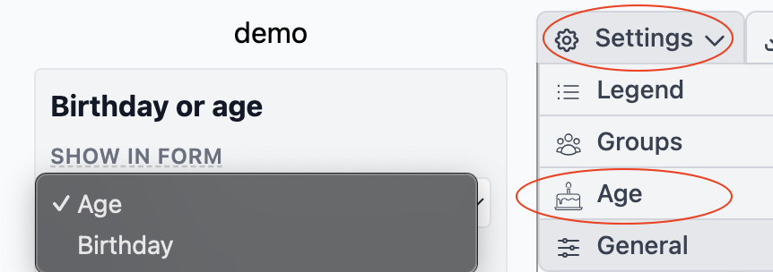
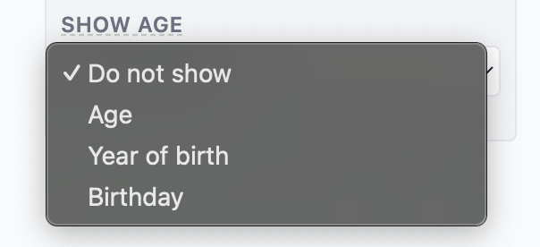

# Birthday / Age

# Birthday
The birthday is needed to determine in which order children must be drawn, because they must be draw in order of age starting with the oldest on the left to the youngest on the right.

If you don't know are you don't want to fill in the whole birthday you can replace the birthday field with the age field in the setting menu.

This speeds up the process

# Age
The Age can also be display in the drawing,

you can chose from

 * not showing
 * Age
 * Year of Birth
 * Birthday

Also the orientation can be changed

* Center
* Top
