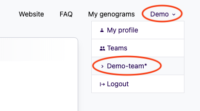
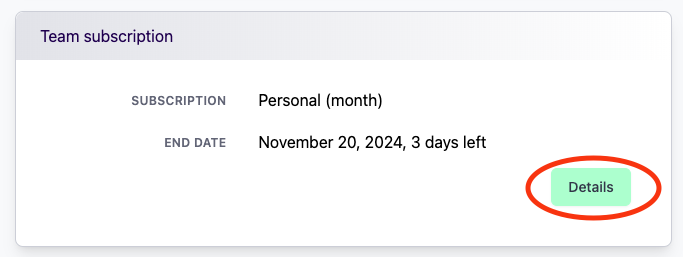
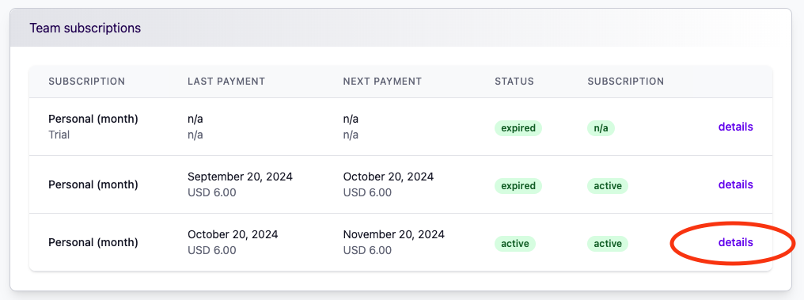
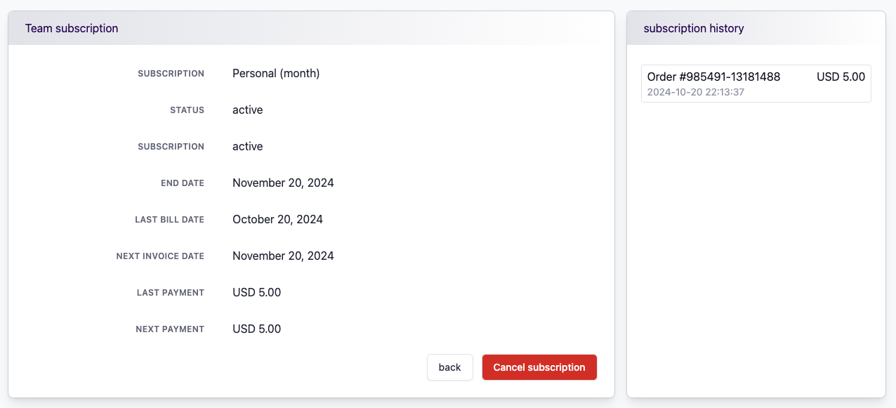

# Cancel Subscription

If you wish to cancel your subscription, follow these steps:

1. **Access Your Account:**  
   In the top-right corner of the screen, click on your name to open the account menu.

2. **Select the Team:**  
   From the dropdown menu, choose the team for which you want to cancel the subscription.  
   

3. **View Subscription Details:**  
   Once you've selected the team, click on **Details** for the current team subscription.  
   

4. **Review Subscription History:**  
   You will be shown an overview of your past and current subscriptions. Click on the **Details** of the active subscription you wish to cancel.  
   

5. **Cancel the Subscription:**  
   In the subscription details screen, you will find the option to cancel your subscription. Click on it to proceed with the cancellation.  
   

After completing these steps, your subscription will be successfully canceled. Please note that canceling a subscription will prevent any future renewals, but you may continue to use the service until the current billing period ends.