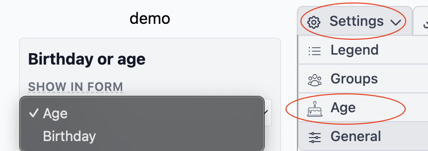

# Birthday / Age

# Birthday

The birthday field is essential for determining the order in which children are displayed. They are arranged from left to right, starting with the oldest on the left and progressing to the youngest on the right. This ensures that the visual representation of the children follows their chronological order.

If you're unsure of a child's exact birthday or prefer not to provide it, you can opt to use the age field instead. This option can be enabled through the settings menu, allowing you to input only the age, which will still maintain the correct order of display.

Please note that either the birthday or age field must be filled in to ensure the children are displayed in the correct sequence.

# Age
The Age can also be display in the drawing,

You have the option to choose how the age is displayed:

 * not showing
 * Age
 * Year of Birth
 * Birthday

not showing will not show anthing, Age will show the age year of birth the year of birth and if the person is past away boot also the year of dead and the birthday shows the birthday

Also the orientation can be changed

* Center
* Top

You have the option to choose how the age is displayed:

* **Not Showing:** This option will not show anything.
* **Age:** Displays the person's current age and if he is past away in brackets the ages on which he died.
* **Year of Birth:** Shows the year of birth. If the individual is past away, both the year of birth and the year of death will be shown.
* **Birthday:** Displays the full birthday (day, month, and year).

Each option provides flexibility in how much detail is shown, allowing you to customize the display based on your preferences or the information available.

In addition, the orientation of the age can be adjusted:

* **Center:** Aligns the information centrally in the symbol.
* **Top:** Positions the information at the top of the symbol.

You also have the option to adjust the font size of the text. see also [fonts](fonts.md)
