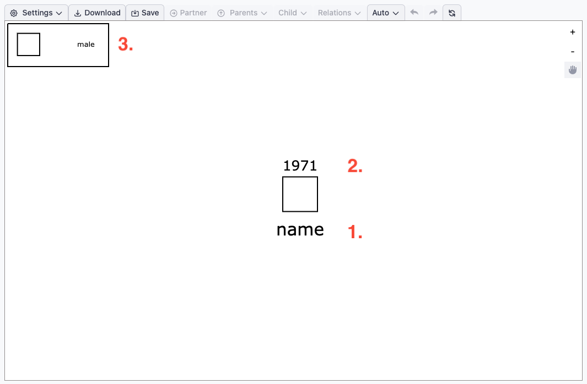
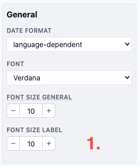
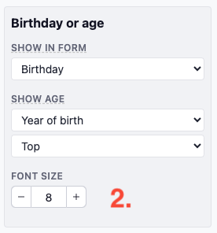
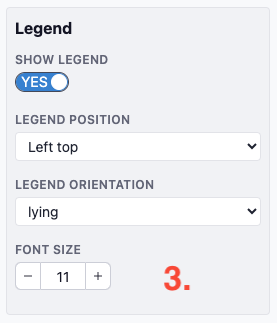

# Fonts

For improved readability, all fonts used in the drawing can be customized to suit your preferences.

In the image above, you can see the three types of fonts that you can adjust:

1. **Label**
2. **Age**
3. **Legend**

## Customizing Font Sizes:

### Label Font Size
Navigate to `Settings > General` to change the font size for labels.  
  
  
### Age Font Size
To adjust the size of the age display, go to `Settings > Age`.  
  

### Legend Font Size:** 
The font size for the legend can be customized in `Settings > Legend`.  
  

### Global Font Settings:

In the `Settings > General` menu, you can also set the **font type** and adjust the **overall font size**. This global setting will change the size of all three font types (Label, Age, and Legend) simultaneously. If you wish to make one font larger or smaller relative to the others, you can fine-tune the specific font size individually in its respective settings.

### Tip:

You can also improve readability by zooming in or out, which adjusts how the text scales in relation to the symbols on the screen. This can help ensure that both text and visual elements are clearly visible and balanced.
