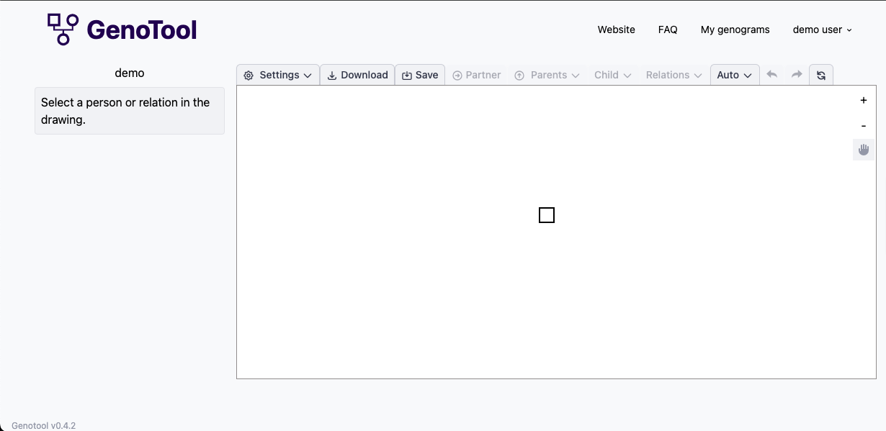
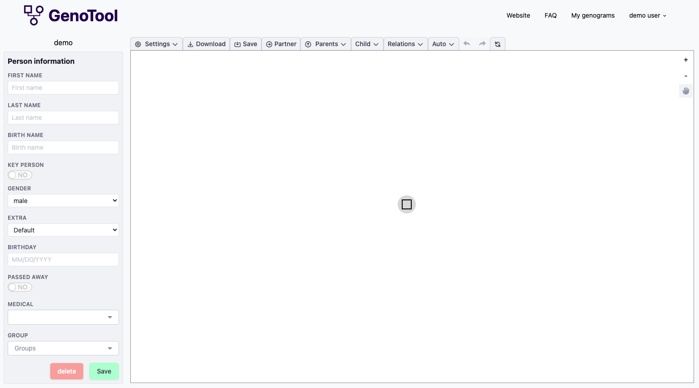

# Getting started

Genotool is a online software tool to draw in a easy way genograms.

When creating a new drawing, a blank sheet like the one below appears.

By selecting the first person in the drawing a detail menu on the left shows up like showed below.

Here can you store and change information about this selected person, the first name will be display in the drawing. By changing the gender, automatically the symbol the changes correspondely.
see [setting up person](setting-up-person.md)

