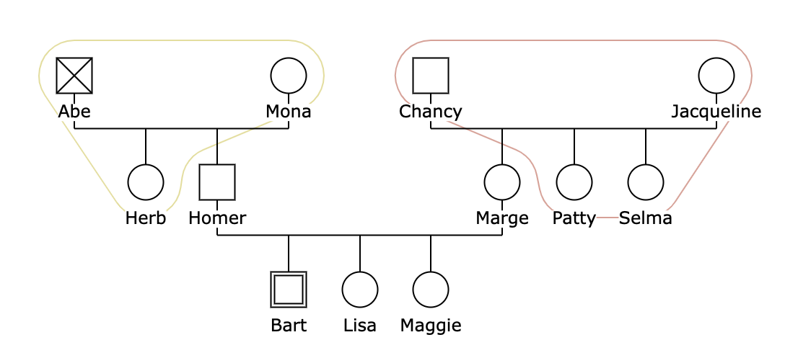
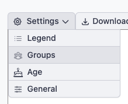
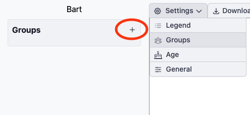
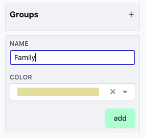
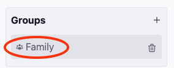
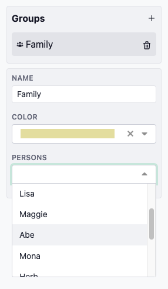

# Groups

With GenoTool, you have the ability to create groups and assign individuals to these groups, providing an organized way to display related persons.

## Create a Group

To create a new group, follow these steps:

1. **Navigate to Group Settings:**  
   Go to `Settings > Groups`.  
   

2. **Add a New Group:**  
   Click on the **plus sign** (`+`) to initiate the creation of a new group.  
   

3. **Name the Group:**  
   Enter a name for your new group and click **Save** to finalize its creation.  
   

Your new group is now ready to use!

## Add a Person to a Group

Once a group is created, you can easily assign individuals to it:

1. **Select the Group:**  
   Click on the group you just created to open its settings.  
   

2. **Assign Members:**  
   A dropdown list will appear, allowing you to select individuals to be part of this group. Simply choose the relevant persons from the list.  
   

### Important Note:
If the individuals in the group are not positioned closely together in the drawing, this may result in unusual or distorted shapes when visualizing the group. Keep this in mind when organizing persons into groups, as it can affect the appearance of the overall layout.

By organizing persons into groups, you can better manage related members and ensure a more structured view.