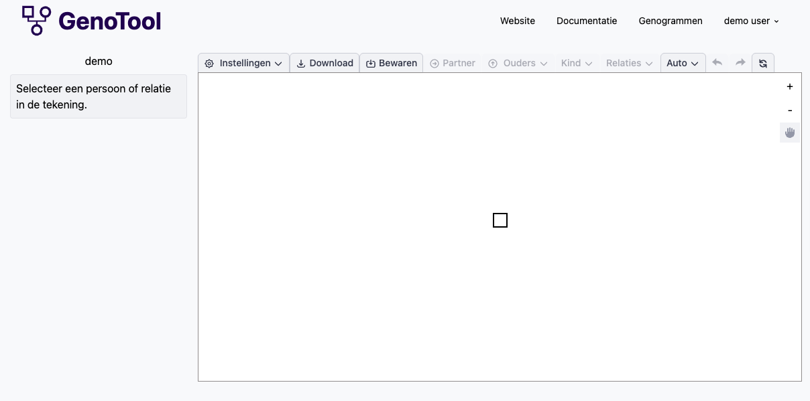
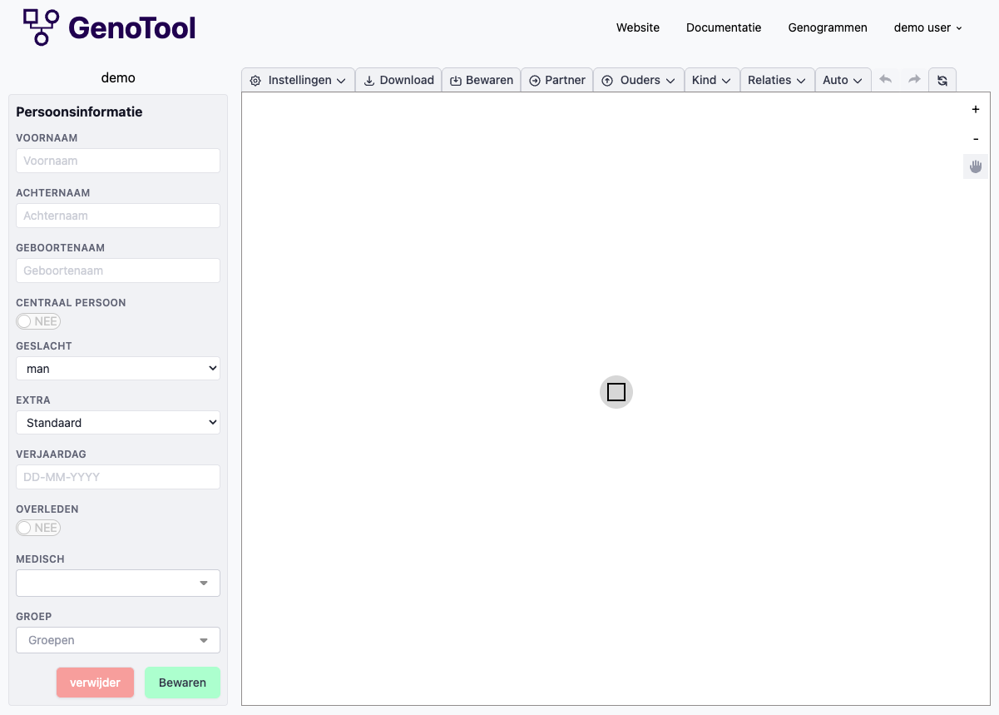
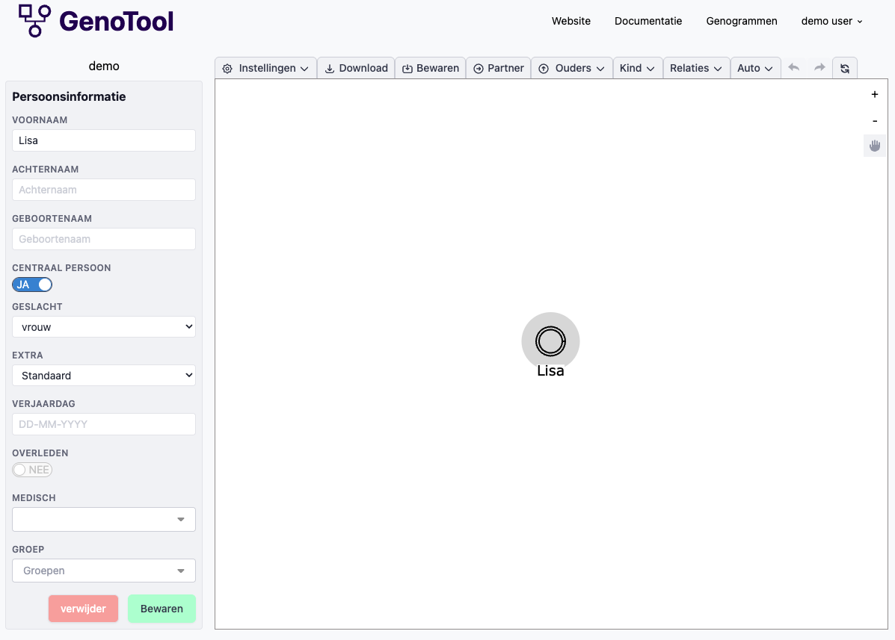
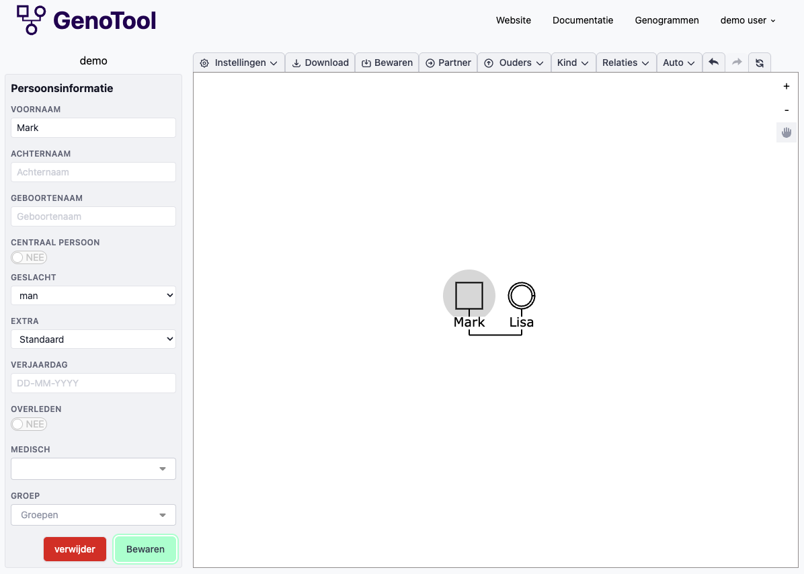
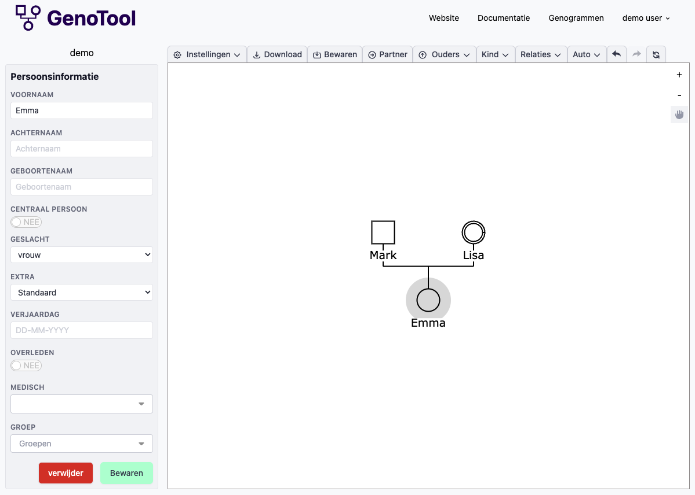
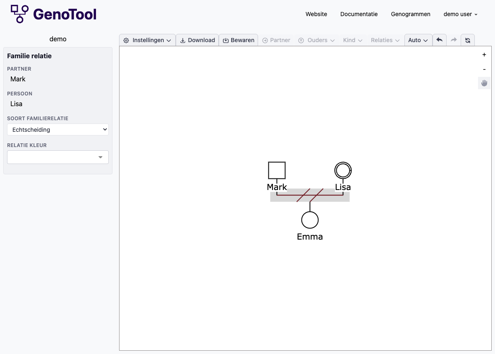
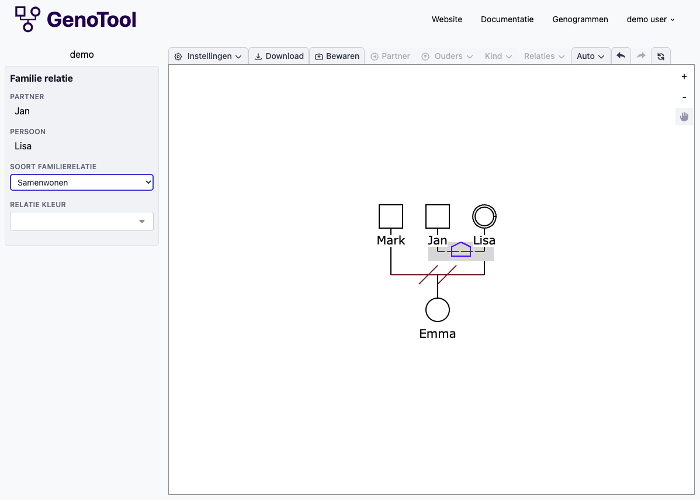
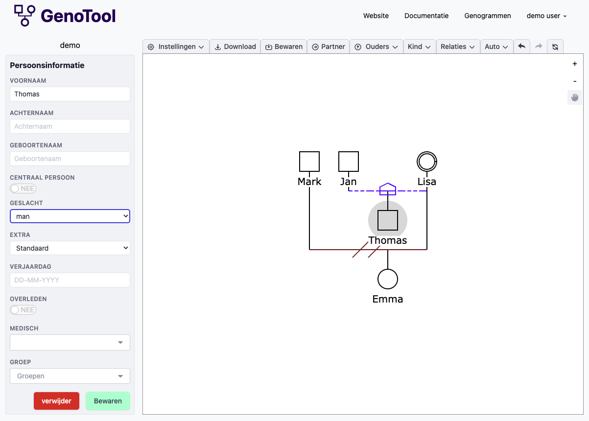

# Aan de slag

GenoTool is een online tool waarmee u op een eenvoudige manier genogrammen kunt tekenen. Waar u op papier bij elke wijziging opnieuw moet beginnen, past GenoTool uw tekening automatisch aan. U kunt uw genogram eenvoudig delen met collega's, exporteren voor in rapporten en op elk moment aanpassen.

## Het werkblad leren kennen

Wanneer u een nieuwe tekening aanmaakt, verschijnt een leeg werkblad met één startpersoon (een vierkant).

Klik op de persoon om deze te selecteren. Aan de linkerkant verschijnt het informatievenster waar u gegevens van deze persoon kunt bekijken en bewerken.

De belangrijkste onderdelen van het scherm zijn:

- **Werkbalk** (bovenaan) — Hier vindt u knoppen zoals **Partner**, **Ouders**, **Kind** en **Relaties** om uw genogram op te bouwen.
- **Informatievenster** (links) — Hier bewerkt u de gegevens van de geselecteerde persoon: naam, geslacht, verjaardag en meer.
- **Werkblad** (midden) — Hier ziet u uw genogram. U kunt personen verslepen en in- en uitzoomen.

## Tutorial: een samengesteld gezin tekenen

In deze tutorial tekenen we stap voor stap een samengesteld gezin: een moeder die gescheiden is en nu samenwoont met een nieuwe partner. Elk heeft een kind. Dit is een veelvoorkomende gezinssituatie die u waarschijnlijk herkent uit uw dagelijkse praktijk.

### Stap 1: De eerste persoon bewerken

De startpersoon op het werkblad wordt de moeder in ons voorbeeld.

1. Klik op de persoon (het vierkant) om deze te selecteren.
2. Vul bij **Voornaam** de naam "Lisa" in.
3. Wijzig het **Geslacht** naar **Vrouw**. Het vierkant verandert automatisch in een cirkel.
4. Zet **Centraalpersoon** op **Ja**. Lisa is het middelpunt van het genogram en krijgt een dubbele rand.
5. Klik op **Opslaan**.

!!! tip
    De Centraalpersoon is de persoon waar het genogram om draait. In de kinderopvang of begeleiding is dit vaak het kind of de ouder die u begeleidt.

### Stap 2: Een partner toevoegen

Lisa was eerder getrouwd met Mark. We voegen hem toe als partner.

1. Zorg dat Lisa is geselecteerd.
2. Klik in de werkbalk op **Partner**.
3. Er verschijnt een nieuwe persoon naast Lisa, verbonden met een lijn.
4. Klik op de nieuwe persoon en vul bij **Voornaam** "Mark" in. Het geslacht staat standaard op **Man** (vierkant).
5. Klik op **Opslaan**.

### Stap 3: Een kind toevoegen

Lisa en Mark hebben samen een dochter, Emma.

1. Selecteer Lisa of Mark.
2. Klik in de werkbalk op **Kind** en kies **Kind toevoegen**.
3. Er verschijnt een nieuwe persoon onder het koppel, verbonden met een lijn.
4. Klik op het nieuwe kind en vul de naam "Emma" in. Wijzig het geslacht naar **Vrouw**.
5. Klik op **Opslaan**.

### Stap 4: De relatie wijzigen naar echtscheiding

Lisa en Mark zijn inmiddels gescheiden. We passen het relatietype aan.

1. Selecteer de relatie.
2. Wijzig het type van **Huwelijk** naar **Echtscheiding**.
3. De lijn tussen Lisa en Mark verandert om de scheiding weer te geven.

Zie [Familie relaties](familie-relaties.md) voor een overzicht van alle 25 beschikbare relatietypes.

### Stap 5: Een nieuwe partner toevoegen

Lisa woont nu samen met Jan. We voegen hem toe als nieuwe partner.

1. Selecteer Lisa.
2. Klik in de werkbalk op **Partner**.
3. Er verschijnt een nieuwe persoon naast Lisa.
4. Klik op de nieuwe persoon en vul "Jan" in als voornaam.
5. Klik op **Opslaan**.
6. Wijzig het relatietype tussen Lisa en Jan van **Huwelijk** naar **Samenwonend** (zie stap 4 voor hoe u dit doet).

### Stap 6: Een kind toevoegen bij de nieuwe partner

Jan heeft een zoon, Thomas, uit een eerdere relatie. We voegen Thomas toe als kind van Jan met een nieuwe (niet-zichtbare) partner.

1. Selecteer Jan.
2. Klik in de werkbalk op **Kind** en kies **Kind toevoegen met nieuwe partner**.
3. Er worden twee nieuwe personen aangemaakt: een partner en een kind.
4. Klik op het kind en vul "Thomas" in als voornaam.
5. Klik op **Opslaan**.

U heeft nu een samengesteld gezin getekend met drie relaties en twee kinderen. GenoTool heeft alle verbindingslijnen automatisch getekend en de posities berekend.

## Opslaan en exporteren

Uw tekening wordt automatisch opgeslagen wanneer u wijzigingen aanbrengt. Daarnaast kunt u uw genogram exporteren:

- Klik op **Downloaden** in de werkbalk om uw genogram op te slaan als JPG-afbeelding. Dit is handig om het genogram op te nemen in een rapport of te delen met collega's.
- Klik op **Opslaan** om uw wijzigingen handmatig op te slaan.

Zie [Exporteren](exporteren.md) voor meer opties.

## Volgende stappen

Nu u de basis kent, kunt u uw genogram verder uitbreiden:

- [Een persoon instellen](persoon-instellen.md) — Voeg details toe zoals verjaardag, medische informatie en overlijden.
- [Emotionele relaties](emotionele-relaties.md) — Teken de onderlinge dynamieken zoals hechting, conflict of misbruik.
- [Familieleden toevoegen](familieleden-toevoegen.md) — Voeg ouders, tweelingen of alternatieve ouders (pleegouders, adoptieouders) toe.
- [Groepen](groepen.md) — Markeer personen die bij elkaar horen, bijvoorbeeld een huishouden.
- [Werkblad-instellingen](werkblad-instellingen.md) — Pas de weergave aan: symboolgrootte, afstanden en positionering.

Klaar om te beginnen? Ga naar [app.genotool.com](https://app.genotool.com) om uw eerste genogram te maken.
