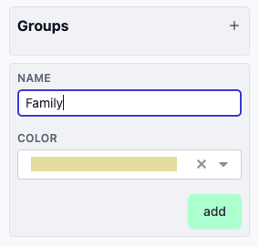
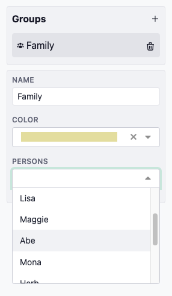

# Groepen

Met GenoTool kunt u groepen aanmaken en personen aan deze groepen toewijzen, wat een georganiseerde manier biedt om gerelateerde personen weer te geven.

## Een groep aanmaken

Volg deze stappen om een nieuwe groep aan te maken:

1. **Navigeer naar Groepsinstellingen:**
   Ga naar `Instellingen > Groepen`.
   

2. **Voeg een nieuwe groep toe:**
   Klik op het **plusteken** (`+`) om een nieuwe groep aan te maken.
   

3. **Geef de groep een naam:**
   Voer een naam in voor uw nieuwe groep en klik op **Opslaan** om de aanmaak te voltooien.
   

Uw nieuwe groep is nu klaar voor gebruik!

## Een persoon aan een groep toevoegen

Zodra een groep is aangemaakt, kunt u eenvoudig personen eraan toewijzen:

1. **Selecteer de groep:**
   Klik op de groep die u zojuist heeft aangemaakt om de instellingen te openen.
   

2. **Wijs leden toe:**
   Er verschijnt een keuzelijst waarmee u personen kunt selecteren om deel uit te maken van deze groep. Kies eenvoudig de relevante personen uit de lijst.
   

### Belangrijk:
Als de personen in de groep niet dicht bij elkaar in de tekening staan, kan dit resulteren in ongebruikelijke of vervormde vormen bij het visualiseren van de groep. Houd hier rekening mee bij het organiseren van personen in groepen, aangezien dit het uiterlijk van de algehele indeling kan beïnvloeden.

Door personen in groepen te organiseren, kunt u gerelateerde leden beter beheren en een meer gestructureerd overzicht garanderen.
