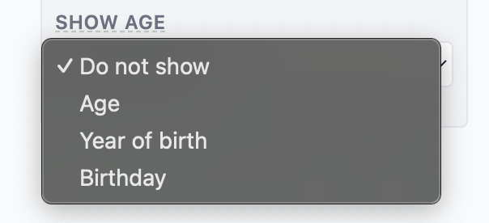

# Verjaardag / Leeftijd

# Verjaardag

Het verjaardagsveld is essentieel voor het bepalen van de volgorde waarin kinderen worden weergegeven. Ze worden van links naar rechts gerangschikt, beginnend met de oudste links en eindigend met de jongste rechts. Dit zorgt ervoor dat de visuele weergave van de kinderen hun chronologische volgorde volgt.

Als u niet zeker bent van de exacte verjaardag van een kind of deze liever niet opgeeft, kunt u ervoor kiezen om in plaats daarvan het leeftijdsveld te gebruiken. Deze optie kan worden ingeschakeld via het instellingenmenu, waarmee u alleen de leeftijd kunt invoeren, wat nog steeds de juiste weergavevolgorde behoudt.

Let op: het verjaardag- of leeftijdsveld moet worden ingevuld om ervoor te zorgen dat de kinderen in de juiste volgorde worden weergegeven.

# Leeftijd

De leeftijd kan ook worden weergegeven in de tekening.

U heeft de mogelijkheid om te kiezen hoe de leeftijd wordt weergegeven:

* **Niet tonen:** Deze optie toont niets.
* **Leeftijd:** Toont de huidige leeftijd van de persoon. Als de persoon is overleden, wordt tussen haakjes de leeftijd waarop hij/zij overleed weergegeven.
* **Geboortejaar:** Toont het geboortejaar. Als de persoon is overleden, worden zowel het geboortejaar als het sterfjaar getoond.
* **Verjaardag:** Toont de volledige verjaardag (dag, maand en jaar).

Elke optie biedt flexibiliteit in hoeveel detail wordt getoond, zodat u de weergave kunt aanpassen op basis van uw voorkeuren of de beschikbare informatie.

Daarnaast kan de oriëntatie van de leeftijd worden aangepast:

* **Midden:** Lijnt de informatie centraal uit in het symbool.
* **Boven:** Plaatst de informatie bovenaan het symbool.

U heeft ook de mogelijkheid om de lettergrootte van de tekst aan te passen. Zie ook [Lettertypen](lettertypen.md).
